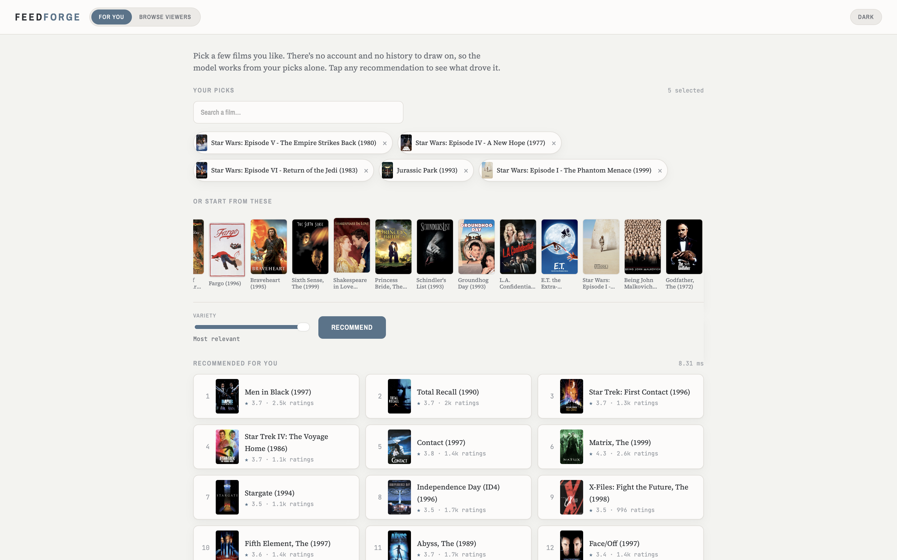
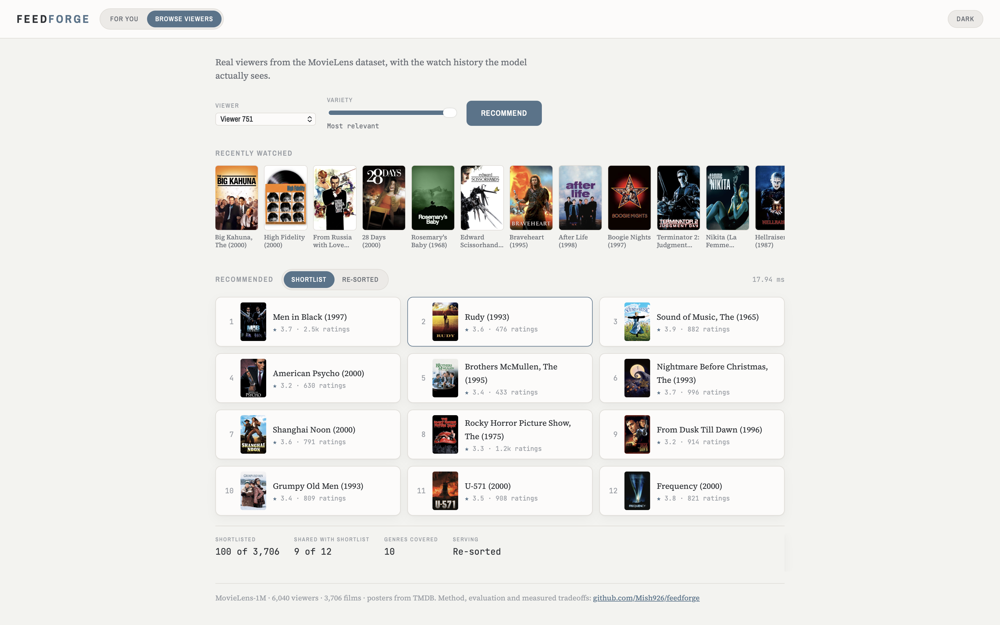

# FeedForge: Two-Stage Recommendation System

> A production-shaped movie recommender: transformer retrieval, learned reranking, and an honest account of which parts survived evaluation.

FeedForge implements the two-stage architecture used by large-scale feed and recommendation systems. Stage one retrieves a candidate shortlist from the full catalogue with a BERT4Rec transformer trained on viewing sequences. Stage two reranks that shortlist with a LightGBM LambdaRank model over 14 features. The system serves through a FastAPI backend with caching, deterministic A/B assignment, and per-arm latency reporting, and ships with an interactive frontend that works both for cold-start visitors and for real dataset viewers.

The evaluation is deliberately strict: every accuracy number is full-ranking against the entire catalogue, never against sampled negatives, and every claimed improvement is tested for statistical significance before it is believed. Several ideas from the original design did not survive that standard. Each one was diagnosed, and the architecture changed in response.



*Cold-start mode: recommendations built from a visitor's picks alone, with a variety control and per-item ratings.*



*Viewer mode: a real MovieLens history, the retrieved shortlist, and the reranked ordering, with rank movement shown per title.*

▶️ **[Watch the demo](https://drive.google.com/file/d/13M-oA5gP3AQmh-RZ--1Y-dBCiggaJmO3/view?usp=share_link)**

---

## Contents

- [Architecture](#architecture)
- [Measured results](#measured-results)
- [What broke, and what changed because of it](#what-broke-and-what-changed-because-of-it)
- [Serving and performance](#serving-and-performance)
- [Setup](#setup)
- [Running the experiments](#running-the-experiments)
- [Project structure](#project-structure)
- [Design notes](#design-notes)
- [Limitations](#limitations)

---

## Architecture

```
                 3,706 films
                      │
      ┌───────────────▼────────────────┐
      │  STAGE 1: CANDIDATE RETRIEVAL  │
      │  BERT4Rec (transformer)        │
      │  masked-item objective on      │
      │  1M viewing sequences          │
      └───────────────┬────────────────┘
                      │  top 100, seen items filtered
      ┌───────────────▼────────────────┐
      │  STAGE 2: RANKING              │
      │  LightGBM LambdaRank           │
      │  14 features: retrieval rank &  │
      │  score, ViT poster similarity,  │
      │  genre affinity, release year,  │
      │  co-occurrence PMI, popularity, │
      │  viewer demographics            │
      └───────────────┬────────────────┘
                      │  optional MMR diversification
                      ▼
              10 recommendations
```

**Stage 1, retrieval.** BERT4Rec implemented from the paper (Sun et al., CIKM 2019): a bidirectional transformer over item-ID sequences trained with a cloze objective, where random items are masked and predicted from both left and right context. At inference a `[MASK]` token is appended to the user's history and the distribution at that position is the next-item prediction. Learned positional embeddings, weight tying between the item embedding and output projection, padding-masked attention.

**Stage 2, ranking.** LightGBM with a listwise LambdaRank objective. Gradient-boosted trees rather than a neural ranker, deliberately: GBDT handles heterogeneous tabular features (ranks, counts, cosine similarities, categorical demographics) without normalisation work and trains in seconds, which is why it was the production standard for ranking stages for years.

**Serving.** FastAPI, with the expensive transformer forward pass cached per user and history length, so cache invalidation is automatic when a history grows. Redis is a drop-in via `REDIS_URL`; without it an in-process TTL cache keeps the demo dependency-free.

---

## Measured results

All accuracy metrics are **full ranking**: the held-out item is ranked against every item in the catalogue, minus items the user has already seen. Leave-one-out split per user, sorted by timestamp.

### Retrieval quality

| Model | Recall@10 | NDCG@10 | Recall@20 |
|---|---|---|---|
| BERT4Rec (200 epochs) | **0.296** | **0.165** | 0.404 |
| Most-popular baseline | 0.037 | 0.018 | 0.068 |

The transformer is 8x the popularity baseline. For reference, published full-ranking reproductions of BERT4Rec on ML-1M land in a similar range (Petrov & Macdonald, RecSys 2022), while undertrained implementations score far lower, so 200 epochs was necessary rather than decorative.

### Evaluation protocol matters more than the model

Running the *same trained model* under the sampled-negatives protocol used in much of the literature:

| Protocol | Recall@10 |
|---|---|
| Full ranking (3,706 candidates) | 0.296 |
| 100 sampled negatives | 0.821 |
| **Inflation factor** | **2.77x** |

Sampled metrics are known to be inconsistent with true ranking (Krichene & Rendle, KDD 2020). This project reports full-ranking numbers everywhere; the sampled figure exists only to quantify what the shortcut would have bought.

### Cold start

Real users' histories were truncated to simulate a visitor who has just named *k* films.

| History size | Popularity Recall@10 | BERT4Rec Recall@10 |
|---|---|---|
| 1 item | 0.016 | **0.134** |
| 3 items | 0.016 | **0.213** |
| 5 items | 0.017 | **0.232** |
| 10 items | 0.017 | **0.245** |
| 20 items | 0.017 | **0.261** |

**Personalisation overtakes popularity from a single item**, at roughly 8x recall. This is what the "For you" mode in the demo runs: no account, no history, just the picks.

### Diversity and accuracy tradeoff

MMR reranking over genre vectors, sweeping lambda from pure relevance (1.0) toward maximum variety:

| lambda | NDCG@10 | Intra-list similarity | Genres covered |
|---|---|---|---|
| 1.0 | 0.1544 | 0.489 | 7.0 |
| 0.9 | 0.1543 | 0.470 | 7.3 |
| **0.8** | **0.1541** | **0.439** | **7.8** |
| 0.7 | 0.1510 | 0.407 | 8.4 |
| 0.5 | 0.1421 | 0.333 | 9.7 |
| 0.3 | 0.1295 | 0.273 | 11.0 |

lambda = 0.8 buys a **10% reduction in intra-list similarity for a 0.15% NDCG cost**, close to free. Past lambda = 0.7 the curve bends sharply: lambda = 0.3 costs 16% NDCG. The demo exposes this as a "Variety" slider, so the tradeoff is something a visitor can feel rather than a table they have to read.

### Popularity bias audit

Items were bucketed into equal-interaction-mass terciles (head, mid, tail) and recommendation exposure compared against the catalogue's own distribution:

| Bucket | Catalogue share | Recommendation share |
|---|---|---|
| Head | 0.334 | 0.344 |
| Mid | 0.333 | 0.331 |
| Tail | 0.333 | 0.325 |

Exposure tracks the catalogue almost exactly, so there is **no meaningful popularity amplification** and no mitigation is warranted. A null result, reported as a null result.

---

## What broke, and what changed because of it

Four ideas from the original design failed under evaluation. Three led to architecture changes that are in the shipped system; the fourth is an open limitation with a known cause. Each is recorded here because the diagnosis is the useful part.

### 1. Content fusion at the retrieval stage cost 10 points of recall

ViT-B/16 embeddings of 3,818 movie posters (fetched from TMDB, 1.7% miss rate) were indexed in FAISS and fused with the collaborative candidates by reciprocal rank fusion.

| Candidate source | Recall@100 |
|---|---|
| Collaborative only | **0.669** |
| Content only | 0.051 |
| RRF fusion (equal weight) | 0.565 |

Poster similarity turns out to be a weak next-watch signal, and fusing a weak ranked list into a strong one displaces good candidates from the top of the list. Split by target popularity, content did relatively better on the coldest tercile (0.064 versus 0.033 on the hottest), which confirms the hypothesis directionally but at magnitudes far too small to justify equal-weight fusion.

**Resolution: content was demoted from a retrieval partner to a ranking feature**, where a learned model assigns it whatever weight it earns instead of a weight chosen by hand. Retrieval is collaborative-only in the shipped system. This is the standard production resolution of the same tradeoff: high-recall retrieval, feature-rich ranking.

### 2. Test-set early stopping inverted the reranker's verdict

The first reranker experiment used the test set for early stopping and reported a win. Holding out 10% of training users for early stopping instead, leaving test untouched, flipped the result:

| Protocol | Baseline NDCG@10 | Reranked NDCG@10 |
|---|---|---|
| Early stopping on test (leaked) | 0.1653 | 0.1667 (apparent win) |
| Early stopping on held-out train | 0.1653 | **0.1559 (actual loss)** |

Same model, same data, same code. The entire reported gain was an artefact of the evaluation protocol.

**Resolution: fixed and re-derived.** Model selection never touches the test set now, the leaked number was discarded, and this is the reason the significance test in the next section exists at all.

### 3. The reranker's gain is real but not statistically significant

The diagnosis from the clean-protocol loss was that the ranker had nothing to work with: its two strongest features are the retriever's own rank and score, which together carry 79% of the model's gain, so a second stage was mostly re-deriving the first stage's opinion. The prescribed fix was information the retriever never sees, so genre affinity, release year, co-occurrence PMI, and viewer demographics were added.

**The diagnosis held.** Those features earned real weight (co-occurrence PMI ranked third and viewer occupation fourth by gain importance) and `best_iteration` rose from 2 to 15, meaning the model found genuine signal. The result moved from a loss back to a small gain. But a paired bootstrap over users (10,000 resamples) cannot distinguish that gain from chance:

```
mean NDCG@10 baseline   0.16529
mean NDCG@10 reranked   0.16661
mean delta             +0.00131
95% CI                 [-0.00234, +0.00496]   <- includes zero
bootstrap p                     0.25
users improved / hurt   736 / 642    (4,662 unchanged)
```

**Resolution: the decision rule was fixed before the result was known.** CI excludes zero, the reranker serves; CI includes zero, the simpler system serves. It includes zero, so **the retrieval order serves by default and the reranker runs as the A/B comparison arm.**

This one is not fully solved, and the reason is the dataset rather than the model. Production rerankers win because they receive genuinely orthogonal information: session boundaries, dwell time, time of day, device, content freshness, real-time engagement. None of that exists in a ratings file collected in 2000. Closing it properly means moving to a dataset with session and context signals (MovieLens-25M, Amazon Reviews) and retraining end to end, which is scoped as future work rather than left as an unexplained gap.

### 4. A genre prior hurt cold-start recommendations at every history length

Blending genre affinity into the transformer's scores was expected to stabilise very short histories, where the transformer has least to condition on. It halved accuracy instead (recall@10 of 0.106 versus 0.213 at three items), consistently across every history size tested. Genre affinity is a coarse signal that pulls toward "any comedy" while the transformer has learned specific co-watch structure, so blending dilutes precise information with vague information.

**Resolution: removed on the evidence.** The cold-start path runs pure sequence scoring, which is what the demo serves. There was no bug to repair; the hypothesis was simply wrong, and the measurement said so.

### The through-line

Four separate attempts to inject content signal (retrieval fusion, ranking features, cold-start prior, and diversity reranking) all pointed the same way: **on dense interaction data, collaborative signal dominates content signal at every stage of the pipeline.** That is a finding rather than a setback, and it is visible in the demo. Picking four Star Wars films returns Men in Black, Total Recall, and Star Trek, not because those films look alike, but because the people who watched one watched the other.

---

## Serving and performance

Load tested with Locust: 50 concurrent users, 60 seconds, single uvicorn worker on a laptop, in-process cache.

```
7,680 requests · 129 req/s sustained · 0 errors

GET /api/recommend      p50   11 ms
                        p95   43 ms
                        p99  110 ms
```

**98.9% of requests completed within the 100 ms target.** The p99 tail is cold-cache traffic: a request for a user nobody has asked about yet pays the full transformer forward pass. Aggregate p50 fell from 26 ms to 11 ms over the run as the cache warmed.

Caveats worth stating plainly: single worker, single machine, load generator competing for the same CPU, in-memory rather than distributed cache. These numbers characterise the application, not a production deployment.

---

## Setup

Requires Python 3.9+, macOS or Linux.

```bash
git clone https://github.com/Mish926/feedforge.git
cd feedforge
python3 -m venv .venv && source .venv/bin/activate
python -m pip install -r requirements.txt
```

> **Intel macOS note.** `torch`, `faiss-cpu`, and `lightgbm` each bundle their own OpenMP runtime, and multiple copies in one process cause segfaults on the first heavy native call. `conftest.py` handles this for tests; for scripts, export `KMP_DUPLICATE_LIB_OK=TRUE` and `OMP_NUM_THREADS=1`. Neither is needed on Linux or Colab. `numpy<2` is also pinned because torch 2.2.2 is the last Intel-macOS build.

### 1. Data

```bash
bash scripts/download_data.sh          # MovieLens-1M into data/ml-1m/
```

Posters are optional (used for the UI and the content experiments) and need a free [TMDB API key](https://www.themoviedb.org/settings/api):

```bash
export TMDB_API_KEY=your_key
python scripts/fetch_posters.py --movies data/ml-1m/movies.dat --out data/posters
```

### 2. Train

CPU works but is slow (about 45 s/epoch); a T4 GPU runs 200 epochs in roughly 10 minutes.

```bash
python -m feedforge.train --data data/ml-1m/ratings.dat --epochs 200 --eval-every 10
```

Poster embeddings (GPU strongly preferred):

```python
from feedforge.content import load_vit_encoder, embed_posters
embed_posters("data/posters", load_vit_encoder("cuda"), out_path="data/content_embeddings.npz")
```

Ranker:

```bash
python scripts/train_ranker.py \
    --data data/ml-1m/ratings.dat --checkpoint checkpoints/bert4rec_best.pt \
    --embeddings data/content_embeddings.npz \
    --movies data/ml-1m/movies.dat --users data/ml-1m/users.dat
```

### 3. Serve

```bash
python scripts/build_artifacts.py \
    --data data/ml-1m/ratings.dat --movies data/ml-1m/movies.dat --users data/ml-1m/users.dat
python api/app.py
```

Open **http://localhost:8000**. Set `REDIS_URL` to use Redis instead of the in-process cache.

### Tests

```bash
python -m pytest tests/ -q          # 62 tests, no network or GPU required
```

---

## Running the experiments

Every table above is reproducible:

```bash
python scripts/report_metrics.py      ...   # full-ranking vs sampled metrics
python scripts/eval_candidates.py     ...   # collaborative vs content vs fusion
python scripts/train_ranker.py        ...   # reranker, with and without feature groups
python scripts/significance_test.py   ...   # paired bootstrap on the reranker delta
python scripts/eval_coldstart.py      ...   # cold-start crossover
python scripts/eval_diversity.py      ...   # diversity frontier and popularity audit
```

Each writes JSON to `results/`, which is committed, so the numbers in this README can be checked against the artefacts that produced them. Run any script with `--help` for its arguments.

Load test (server must be running):

```bash
locust -f loadtest/locustfile.py --host http://localhost:8000 --headless -u 50 -r 10 -t 60s
```

---

## Project structure

```
feedforge/
├── feedforge/
│   ├── data.py           # MovieLens loading, leave-one-out split, MLM dataset
│   ├── model.py          # BERT4Rec, implemented from the paper
│   ├── evaluate.py       # full-ranking metrics + the sampled-metrics comparison
│   ├── train.py          # training loop with periodic full-ranking validation
│   ├── content.py        # ViT poster embeddings, FAISS index
│   ├── fusion.py         # reciprocal rank fusion, candidate recall analysis
│   ├── features.py       # genres, release year, demographics, co-occurrence PMI
│   ├── ranker.py         # LambdaRank feature assembly, training, reranking
│   ├── discovery.py      # cold start, MMR diversity, popularity-bias metrics
│   ├── service.py        # serving pipeline: retrieve, feature, rank, explain
│   ├── cache.py          # in-memory / Redis cache behind one interface
│   └── experiment.py     # deterministic A/B assignment, request log, percentiles
├── api/
│   ├── app.py            # FastAPI: recommend, coldstart, compare, explain, metrics
│   └── static/index.html # frontend, no build step
├── scripts/              # training, data prep, and the six experiments
├── loadtest/locustfile.py
├── tests/                # 62 tests: pipeline, content, ranker, features, serving
├── results/              # committed JSON from every experiment
└── screenshots/
```

---

## Design notes

**Why full-ranking evaluation.** Sampled-negative evaluation is faster and produces much prettier numbers (2.77x here). It is also known to rank models inconsistently with true ranking. Every number in this README is full ranking, and the sampled figure is reported only as a measurement of the shortcut's cost.

**Why the reranker still ships.** Its offline gain is not significant, so it does not serve by default, but it is wired as the A/B arm, because the infrastructure for comparing arms is the point and because "no measurable difference on this data" is itself a result worth being able to state.

**What the A/B system does and does not measure.** Assignment is `md5(salt + user_id) % 100`, so a user lands in the same arm across requests and restarts, and changing the salt reshuffles the population. The `/api/metrics` endpoint reports traffic split and per-arm latency percentiles. It does **not** report click-through rate. There are no real users here, so there are no real clicks, and simulated engagement presented as a finding would be fabrication. Arm quality comes from the offline significance test instead.

**Explanations are counterfactual, not decorative.** Clicking a recommendation runs leave-one-out attribution: the item is re-scored with each history item removed, and the resulting score drop measures that item's contribution. It costs one forward pass per history item, which is why it runs on recent history rather than the full sequence, and it is a genuine measurement through the same model rather than a similarity heuristic presented as an explanation.

**Caching strategy.** The cache key is `(user, history length, k)`. Including history length means a user whose history grows automatically misses the stale entry, since a cache that cannot invalidate is a bug waiting to happen. Ranking runs on every request even on a cache hit, because it is sub-millisecond and keeps arm comparisons honest.

---

## Limitations

- **The dataset is the ceiling.** MovieLens-1M has no session boundaries, no dwell time, and no device or context signals, and its interactions span 2000 to 2003. The reranker's null result is partly a statement about this data rather than only about the model. Moving to a dataset with session context is the natural next experiment.
- **Poster embeddings are ImageNet features, not learned for recommendation.** A ViT-B/16 classifier's CLS vector captures visual style, which turns out to be a weak proxy for taste. Fine-tuning the encoder on interaction data would be a fairer test of the content hypothesis than the off-the-shelf embeddings used here.
- **Cold start is simulated, not observed.** Truncating real users' histories approximates a new visitor but keeps the population's overall taste distribution, so the numbers likely flatter the true new-user case.
- **Load-test numbers are laptop numbers.** Single worker, single machine, in-process cache; see the caveats in [Serving and performance](#serving-and-performance).
- **1.7% of films have no poster** (TMDB title-match failures, logged to `data/posters/misses.json`). Those items carry no content features rather than being dropped or imputed.

---

## Tech stack

| Layer | Technology |
|---|---|
| Retrieval | PyTorch, BERT4Rec (2-layer, 64-d, about 354k parameters) |
| Content | torchvision ViT-B/16, FAISS `IndexFlatIP` |
| Ranking | LightGBM LambdaRank, 14 features |
| Serving | FastAPI, uvicorn, Redis or in-process TTL cache |
| Storage | SQLite (WAL) for the experiment log, pickle for serving artefacts |
| Frontend | Vanilla HTML/CSS/JS, no build step, light and dark themes |
| Testing | pytest (62 tests), Locust for load |
| Data | MovieLens-1M (6,040 viewers, 3,706 films, 1M ratings), TMDB posters |

---

## Author

**Mishika Ahuja**, [github.com/Mish926](https://github.com/Mish926)

*FeedForge is a portfolio project demonstrating two-stage recommendation architecture, retrieval and ranking engineering, rigorous offline evaluation, and production serving concerns.*
